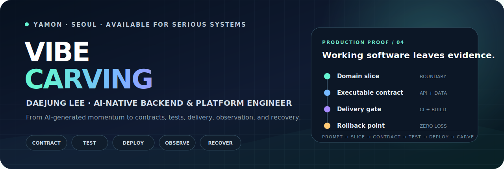
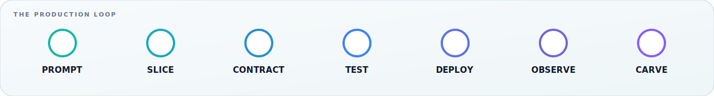
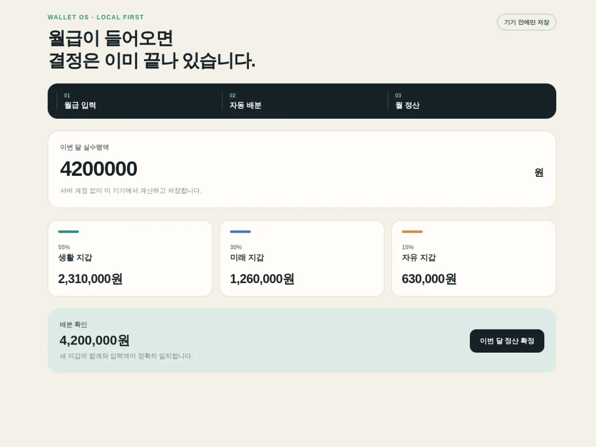
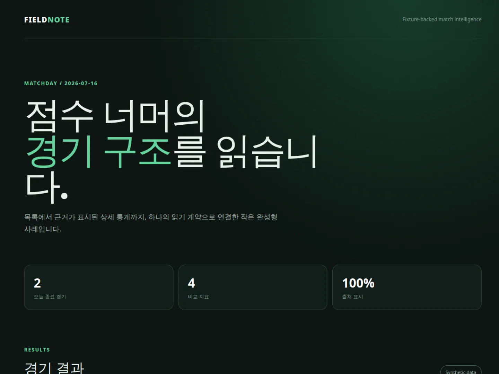
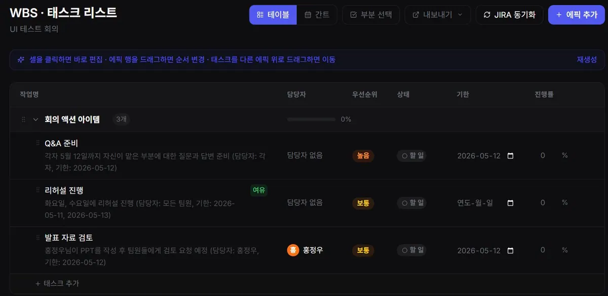

  <a href="https://dejung71020.github.io/">
    <picture>
      <source media="(max-width: 600px)" srcset="assets/vibe-carving-hero-mobile.svg" />
      
    </picture>
  </a>

  <h1>Daejung Lee 이대중</h1>
  
<strong>AI 네이티브 백엔드·플랫폼 엔지니어 @ YAMON</strong>

  
AI로 빠르게 만든 결과를 구조·테스트·배포·관측·복구가 연결된 운영 가능한 시스템으로 다듬습니다.

  
  
  

 

## Vibe Carving

> **Vibe Coding의 생성 속도에 현업의 구조와 검증을 더합니다.** 
> 가장 작은 사용자 결과를 자르고, 계약과 테스트를 고정하고, 배포·관측·복구 증거가 남을 때까지 반복합니다.

## Selected product evidence

<table>
  <tr>
    <td width="50%" valign="top">
      
      <h3>Wallet OS Lite</h3>
      
급여 입력 → 배분 규칙 → 목적별 지갑 → 월 정산. Expo·TypeScript와 로컬 저장 경계로 닫히는 작은 완성형 흐름입니다.

      
<a href="https://github.com/dejung71020/wallet-os-lite"><strong>Repository ↗</strong></a> · <a href="https://dejung71020.github.io/wallet-os-lite/"><strong>Live demo ↗</strong></a>

    </td>
    <td width="50%" valign="top">
      
      <h3>Soccer Intelligence Lite</h3>
      
하나의 fixture와 OpenAPI 계약이 FastAPI 응답부터 Astro 경기 목록·상세·통계 화면까지 이어지는 수직 기능입니다.

      
<a href="https://github.com/dejung71020/soccer-intelligence-lite"><strong>Repository ↗</strong></a> · <a href="https://dejung71020.github.io/soccer-intelligence-lite/"><strong>Live demo ↗</strong></a>

    </td>
  </tr>
  <tr>
    <td width="50%" valign="top">
      
      <h3>WorkB</h3>
      
회의 결과와 액션 아이템을 Jira·Slack·Google Calendar로 연결하는 meeting intelligence 백엔드입니다.

      
<a href="https://github.com/dejung71020/workb-backend"><strong>Backend ↗</strong></a> · <a href="https://dejung71020.github.io/projects/workb"><strong>Case study ↗</strong></a>

    </td>
    <td width="50%" valign="top">
      
      <h3>팡팡팡</h3>
      
이미지 진단부터 위험 안내와 해결 흐름까지 연결한 AI 서비스입니다. FastAPI·ONNX·RAG 파이프라인을 실제 배포했습니다.

      
<a href="https://github.com/dejung71020/QUAIL_BACK-END"><strong>Backend ↗</strong></a> · <a href="https://play.google.com/store/apps/details?id=com.quail.pangpangpang"><strong>Google Play ↗</strong></a>

    </td>
  </tr>
</table>

## Proof, not promises

<table>
  <tr>
    <td width="33%" valign="top"><h3>01 · Test</h3>
도메인 규칙 단위 테스트, API fixture 계약, Astro·Expo production build를 공개 CI에서 반복 검증합니다.
</td>
    <td width="33%" valign="top"><h3>02 · Delivery</h3>
GitHub Actions와 Pages로 Lite 저장소와 포트폴리오를 재현 가능하게 빌드·배포합니다.
</td>
    <td width="33%" valign="top"><h3>03 · Recovery</h3>
변경 전 tag·mirror·bundle을 만들고, 삭제·복구 리허설에서 원본 tree SHA 일치를 확인했습니다.
</td>
  </tr>
</table>

## Six repositories that explain my work

| | Repository | Evidence |
|---:|---|---|
| 01 | **[production-vibe-carving-notes](https://github.com/dejung71020/production-vibe-carving-notes)** | 익명화된 문제·제약·결정·실패·교훈 |
| 02 | **[QUAIL_BACK-END](https://github.com/dejung71020/QUAIL_BACK-END)** | AI 진단 파이프라인과 실서비스 배포 |
| 03 | **[workb-backend](https://github.com/dejung71020/workb-backend)** | 외부 업무 도구를 연결하는 통합 백엔드 |
| 04 | **[wallet-os-lite](https://github.com/dejung71020/wallet-os-lite)** | 로컬 우선 지갑 도메인의 완성형 수직 흐름 |
| 05 | **[soccer-intelligence-lite](https://github.com/dejung71020/soccer-intelligence-lite)** | FastAPI·Astro·OpenAPI 계약 조립 검증 |
| 06 | **[dejung71020.github.io](https://github.com/dejung71020/dejung71020.github.io)** | 실제 UI 증거 중심 Astro 포트폴리오 |

## Engineering stack

  

 

`Domain boundaries` · `Explicit contracts` · `Colocated tests` · `SSOT config` · `Staged delivery` · `Observable operations` · `Traceable recovery`

## GitHub activity

  
  

---

  <strong>구조를 설계하고, 증거로 검증하고, 운영까지 책임집니다.</strong>  
  <a href="https://dejung71020.github.io/">Portfolio</a> · <a href="mailto:dejung71020@gmail.com">dejung71020@gmail.com</a> · 010-9745-1519
    
  회사 관련 내용은 공개 홈페이지와 익명화된 개인 경험만 사용하며 내부 코드·고객 데이터·관리자 화면은 공개하지 않습니다.

