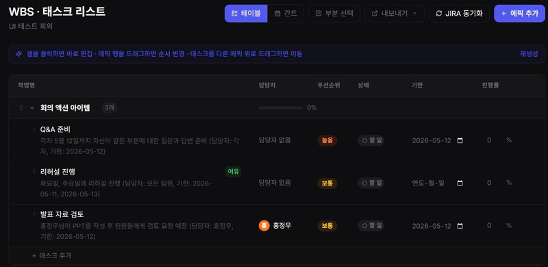
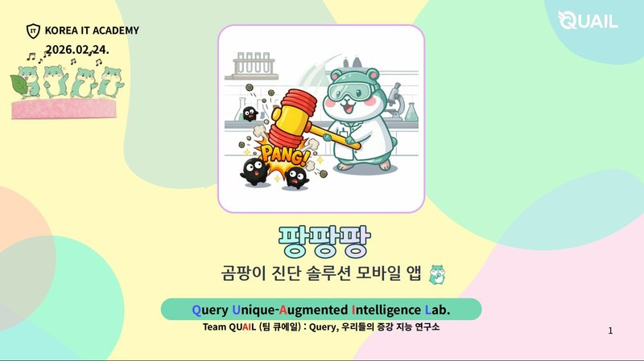
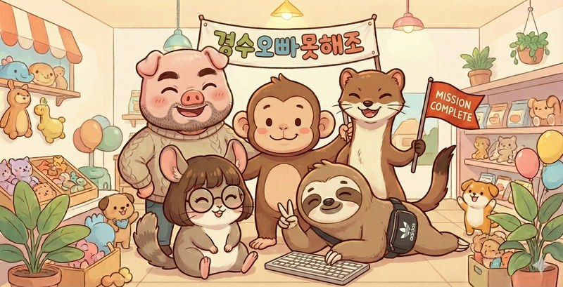

# 이대중 (Lee Daejung)

**서비스의 완성도를 끝까지 책임지는 백엔드 개발자**

설계부터 배포, 유지보수까지 직접 경험했습니다. 
지금도 팡팡팡 앱을 운영하며 실서비스의 무게를 배우고 있습니다.

---

## 🛠 Tech Stack

**Backend**

**Database**

**Infra & DevOps**

**Auth & Security**

---

## 💼 Projects

### 🤝 WorkB — 회의 에이전트 웹서비스
> KDT 최종 팀프로젝트 | 2026.04 – 2026.05 | 팀 6명

화자분리 → 회의 요약 → Jira · Slack · Google Calendar 원클릭 내보내기

n8n → FastAPI 전환, BaseClient 추상화로 **5개 외부 서비스** 단일 인터페이스 통합

---

### 🍄 팡팡팡 — 곰팡이 진단 AI 앱
> KDT 중간 팀프로젝트 | 2026.01 – 2026.02 | 팀 4명 | **Google Play 실배포 · 운영 중**

EfficientNet ONNX → Grad-CAM → ChromaDB RAG → Gemini 리포트 AI 파이프라인

AWS EC2 · S3 · Route53 · Docker 기반 실제 배포 및 유지보수 경험

---

### 🛒 애완용품샵 — 반려동물 이커머스
> KDT 세미 팀프로젝트 | 2025.12 – 2026.01 | 팀 5명

주문 · 재고 · 결제를 하나의 트랜잭션으로 묶어 데이터 불일치 0건 유지

OpenAI FAQ 챗봇 구현 (50개 JSON 주입으로 환각 차단)

---

## 📊 GitHub Stats

---

📞 010-9745-1519 &nbsp;|&nbsp; ✉️ dejung71020@gmail.com &nbsp;|&nbsp; 🌐 [dejung71020.github.io](https://dejung71020.github.io/)

